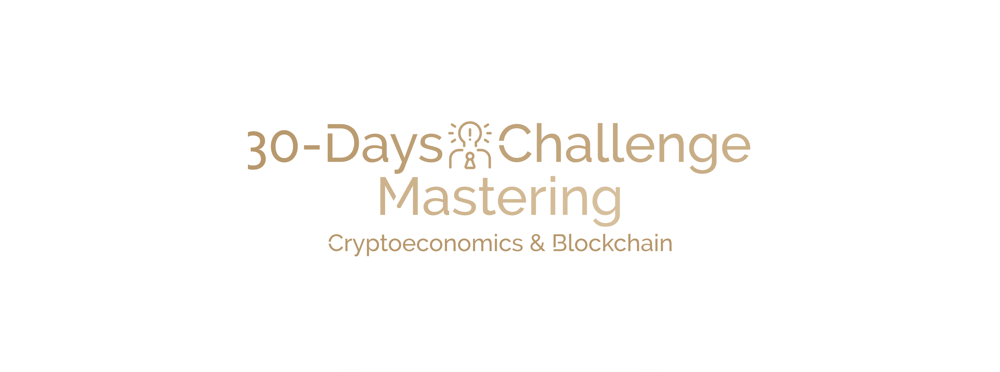
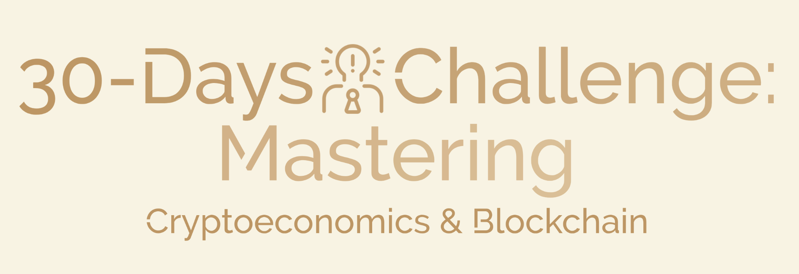

# 🚀 30-Days Challenge: Mastering Cryptoeconomics & Blockchain

<!--  -->

Welcome to the 30-days Cryptoeconomics & Blockchain Technology Challenge! This repository will host all code, resources, and documentation for the challenge.

Welcome to the 30-day Cryptoeconomics & Blockchain Technology Challenge! This repository will host all the code, resources, and documentation for the challenge.

## 📚 Learning Path
A summary of the topics covered during the challenge:
- 🧮 Mathematics and Theoretical Foundations
- 💻 Computer Science
- 🎮 Game Theory
- 🏦 Cryptoeconomics
- ⛓️ Blockchain-Specific Knowledge

## 📂 Project Structure
- `projects/`: Documentation and code for each mini-project.
- `resources/`: Reading lists, templates, and links.
- `docs/`: Detailed documentation for setup, milestones, and overviews.
- `wiki/`: Additional information and notes.

## 🛠️ Installation Instructions
1. Clone the repository.
2. Install dependencies with `pip install -r requirements.txt`.
3. Run the projects according to their individual instructions.

## 🚀 Usage
- Refer to individual project README files for usage instructions.

## 🤝 Contribution Guidelines
- Follow branch naming conventions and use pull requests for contributions.
- Report issues using GitHub Issues.

## ⚖️ License Information
This project is licensed under the MIT License.

## 📧 Contact Information
For support or questions, reach out via [contact@yuriodev.co.uk](mailto:contact@yuriodev.co.uk).
